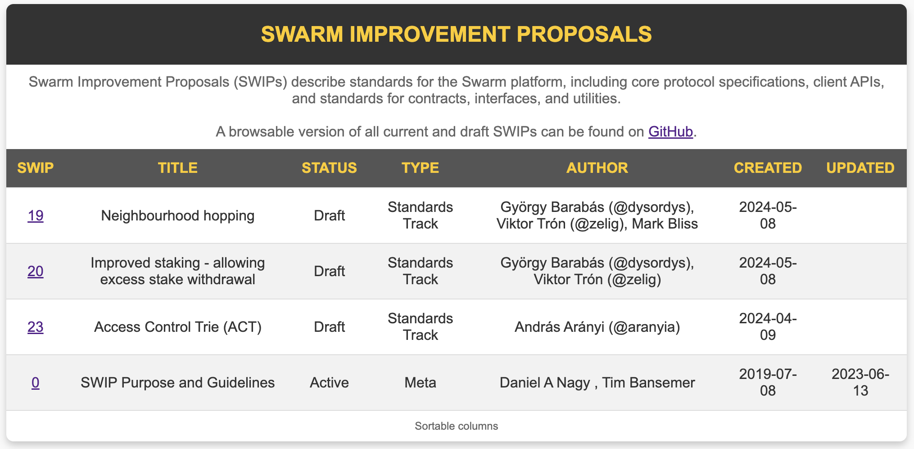

# SWIP Table Generator - [demo](https://bee-3.fairdatasociety.org/bzz/ea9e33c16480ef9074928758073345953033640a7dc7f6786273c4c5289cae19/)

Visit [ethersphere/SWIPs](https://github.com/ethersphere/SWIPs)

 <div align="left">

<p align="left">
    <a href="https://discord.com/channels/799027393297514537/1239813439136993280">
         
    </a>
    
</p>
<h3 align="left"><span style="color:orange;">S</span>warm <span style="color:orange;">I</span>mprovement <span style="color:orange;">P</span>roposal

</h3>
</div>

## Overview

The **SWIP Table Generator** is a Python script that automates the generation of a browsable HTML table from Swarm Improvement Proposal (SWIP) documents. Given SWIP numbers, it fetches metadata from GitHub and displays it in a sortable, styled HTML table. This tool is ideal for Swarm developers and contributors who need a quick, easy way to review SWIP details.

## Preview



## Features

- **Fetch SWIP Data**: Automatically retrieves SWIP data from the provided numbers.
- **Responsive HTML Table**: Generates a clean, sortable HTML table.

## Requirements

- **Python 3.8+**

## Installation

Clone the repository to your local machine:

```bash
git clone https://github.com/tamas6/SwipGen.git
cd SwipGen
```

## Usage

```zsh
python SWIP.py
```

In the following screen please indicate the numbers of the swips you would like to list.

The swip_urls.html file will be located in the folder that you can upload to feed with [swarm-cli](https://github.com/ethersphere/swarm-cli/tree/master)
